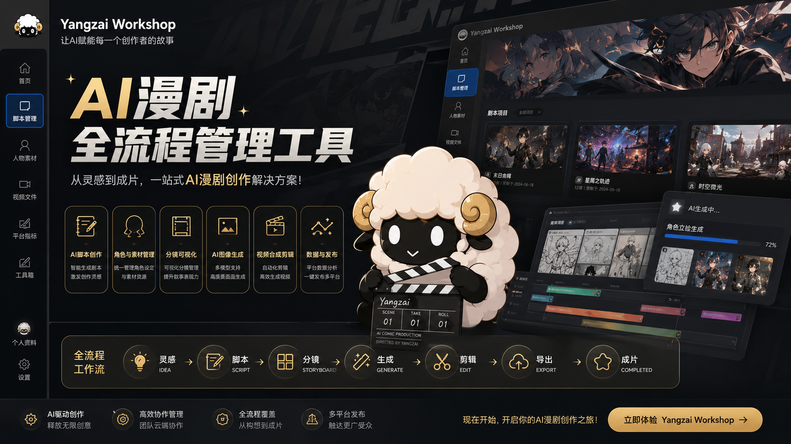

# Yangzai Workshop

> 一款面向小说漫剧创作者的本地化桌面生产工具，基于 .NET 8 + WPF 开发，覆盖从小说导入、剧本改编、素材管理到多平台数据统计的完整工作流。

[](https://dotnet.microsoft.com/)
[](https://github.com/dotnet/wpf)
[](./LICENSE)
[]()


---

## ✨ 核心特性

- **零数据库依赖** —— 文件夹即数据，绿色免安装，复制目录即可完成项目迁移
- **悬浮窗口设计** —— `AllowsTransparency` + 大圆角边框 + 深度投影，悬浮于桌面视觉体验
- **智能分章** —— 4 种正则并行匹配：`第X部 第Y章` 组合格式 / `第X章` 标准格式 / `序章/番外` 特殊章节 / `Chapter X` 英文格式，中文数字自动转换
- **跟随系统主题** —— 切换时 `DynamicResource` 即时更新，页面缓存自动重建
- **完整工作流** —— 8 大功能模块，覆盖小说改编全流程
- **现代化 UI** —— 自定义无边框悬浮窗口、圆角卡片、导航 ListBox 选中缩放动效、页面淡入淡出过渡
- **文件系统即架构** —— `Image\小说\{mediaFolder}\{章节}` / `Video\{mediaFolder}\{章节}` 纯目录结构，MediaFolder 自动防同名碰撞
- **极简技术栈** —— 仅引入 1 个第三方图表库（ScottPlot），其余全部使用 .NET 原生能力
- **数据可视化** —— 三平台（抖音 / 快手 / Bilibili）折线图，CSV 数据导入
- **安全备份** —— 一键 ZIP 备份与恢复，回收站 30 天自动清理，图片/视频内嵌预览

---

## 🛠 技术栈

| 技术组件 | 说明 | 类型 |
|---------|------|------|
| 运行环境 | .NET 8 SDK（`net8.0-windows`） | 系统基础 |
| UI 框架 | WPF (Windows Presentation Foundation) | .NET 原生 |
| 数据序列化 | System.Text.Json | .NET 原生 |
| 图表组件 | [ScottPlot.WPF](https://scottplot.net/) 5.0+ | 唯一第三方库 |
| 图标方案 | Segoe MDL2 Assets 系统字体 | Windows 原生 |
| 架构模式 | 简易 MVVM 分层（Views / Services / Models） | 原生实现 |

---

## 📸 功能概览

### 🏠 首页
- 视频轮播区（双 MediaElement 交叉淡入淡出，支持自动/手动切换）
- 快捷目录入口（根目录 / 图片 / 视频文件夹一键打开）
- 一键开始按钮（快速跳转剧本管理）
- 公告栏 + 版本信息

### 📖 剧本管理（核心工作区）
- 右侧书籍列表：导入 TXT 小说，自动编码检测，封面裁剪上传
- 顶部章节导航：4 种正则智能分章 + 手动分章（支持拆分/合并）
- 三栏可拖拽内容区（窗口缩放时等比压缩防溢出）：
  - 小说原内容 — RichTextBox 支持文字高亮标记（5 色）+ 复制
  - 剧本内容 — 可编辑 RichTextBox，失焦自动保存
  - 图像素材 — 3 列网格，支持拖拽导入、MemoryStream 原图加载、大图预览（滚轮缩放+拖拽平移）

### 👤 人物素材
- 按小说联动的人物列表，两列网格布局
- 角色头像裁剪上传、性格设定编辑、形象素材管理
- 图片复制保留原始分辨率

### 🎬 视频文件
- 封面横条选择小说 + 章节导航联动，胶卷风格卡片展示（MaxWidth 居中防变形）
- 视频缩略图自动提取（MediaPlayer 首帧截图，多点位尝试防黑帧）
- 内嵌播放器：播放/暂停、进度条拖拽、双击全屏、空格键控制、播完停在末帧

### 📊 平台指标
- 抖音 / 快手 / Bilibili 三平台切换
- 播放量、点赞量、评论量三张折线图（ScottPlot）
- CSV 数据导入、手动录入、拖拽排序

### 👤 个人资料
- 头像裁剪上传（即时刷新导航栏小头像）
- 用户名 / 签名编辑
- 个人成就列表（作品卡片 + 统计数据编辑，收益红色高亮）

### 🧰 工具箱
- 小说素材下载跳转、工作目录快速打开
- 回收站管理（还原 / 删除 / 清空 / 图片视频内嵌预览 / 还原即时刷新对应页面）
- 备忘录（独立窗口，2 秒延迟自动保存）

### ⚙️ 设置
- 亮色 / 暗色主题切换（支持跟随系统主题，DynamicResource 即时更新）
- 工作目录配置、字体大小滑块、轮播间隔设置
- 公告编辑、数据 ZIP 备份与恢复、关于页面

---

## 📁 项目结构

```
Yangzai Workshop/
├── YangzaiWorkshop.sln                # 解决方案文件
├── YangzaiWorkshop.csproj             # 项目文件
├── App.xaml / App.xaml.cs             # 应用入口，启动初始化
├── MainWindow.xaml / .cs              # 主窗口（悬浮无边框 + ListBox 侧边导航缩放动效 + 页面淡入淡出）
├── Models/                            # 数据实体模型
│   ├── AppConfig.cs                   # 全局配置
│   ├── NovelInfo.cs                   # 小说元数据 + 统计数据
│   ├── Chapter.cs                     # 章节（原文 + 剧本）
│   ├── Character.cs                   # 人物角色（性格 + 素材）
│   ├── PlatformStats.cs               # 平台统计（日数据）
│   ├── Memo.cs                        # 备忘录
│   └── TrashItem.cs                   # 回收站
├── Services/                          # 业务服务层
│   ├── FileService.cs                 # 文件 I/O、JSON 持久化、回收站、备份恢复、MediaFolder 唯一生成
│   ├── ChapterParserService.cs        # 智能分章（4 种正则 + 中文数字 + 目录过滤）
│   ├── NavigationService.cs           # 页面导航 + 缓存管理（单例）
│   ├── ThemeService.cs                # 主题切换（DynamicResource 即时更新）
│   └── ViewHelpers.cs                 # 通用视图工具（圆角裁切、图片查看器、色值解析、数字格式化）
├── Views/                             # 页面视图（UserControl）+ 工具窗口
│   ├── HomePage.xaml/.cs              # 首页
│   ├── ScriptPage.xaml/.cs            # 剧本管理
│   ├── CharacterPage.xaml/.cs         # 人物素材
│   ├── VideoPage.xaml/.cs             # 视频文件
│   ├── StatsPage.xaml/.cs             # 平台指标
│   ├── ToolboxPage.xaml/.cs           # 工具箱
│   ├── ProfilePage.xaml/.cs           # 个人资料
│   ├── SettingsPage.xaml/.cs          # 设置
│   ├── CropWindow.xaml/.cs            # 图片裁剪工具窗口
│   └── InputDialog.xaml/.cs           # 通用输入对话框
├── Assets/                            # 静态资源
│   └── Icon/
│       └── Yangzai.ico                # 应用图标（圆角）
└── Resources/                         # 样式与主题
    ├── Themes/
    │   ├── LightTheme.xaml            # 亮色主题（9 色 + 阴影）
    │   └── DarkTheme.xaml             # 暗色主题（9 色 + 阴影）
    └── Styles/
        ├── CommonStyles.xaml          # 按钮 / 文本框 / 滚动条 / 导航 ListBox 缩放动画
        └── CardStyles.xaml            # 卡片阴影与圆角样式
```

---

## 🚀 快速开始

### 环境要求

- **操作系统**：Windows 10 1809+ / Windows 11
- **运行时**：[.NET 8 Desktop Runtime](https://dotnet.microsoft.com/download/dotnet/8.0)（自包含发布可免安装）

### 克隆与运行

```bash
# 克隆仓库
git clone https://github.com/yourname/YangzaiWorkshop.git
cd YangzaiWorkshop

# 还原依赖并运行
dotnet restore
dotnet run
```

### 发布为绿色免安装版

```bash
dotnet publish -c Release -r win-x64 --self-contained true \
  /p:PublishSingleFile=true /p:IncludeNativeLibrariesForSelfExtract=true
```

---

## 📦 数据存储架构

程序采用**纯本地文件系统存储**，无任何数据库依赖。工作数据默认存放于 `WorkData/` 目录：

```
WorkData/
├── Config/
│   ├── appsettings.json       # 全局配置（主题、字体等）
│   ├── notice.txt             # 首页公告
│   └── banners/               # 首页轮播视频
├── Novels/
│   └── {novelId}/
│       ├── info.json          # 小说元数据 + 统计数据
│       ├── cover.png          # 小说封面
│       ├── original.txt       # 小说原文
│       ├── chapters.json      # 章节缓存
│       └── Characters/        # 角色信息（头像、性格设定）
├── Image/
│   ├── 人物素材/
│   │   └── {mediaFolder}/     # 按小说 MediaFolder（唯一，防同名碰撞）
│   │       └── {charId}/      # 角色图片素材
│   └── 小说/
│       └── {mediaFolder}/     # 按小说 MediaFolder
│           └── {第X章}/       # 章节配图（按章节分目录）
├── Video/
│   └── {mediaFolder}/         # 按小说 MediaFolder
│       └── {第X章}/           # 章节视频（按章节分目录）
└── .trash/                    # 回收站（30 天自动清理）
```

---

## 🎨 配色规范

| 资源键 | 亮色模式 | 暗色模式 | 用途 |
|-------|---------|---------|------|
| `WindowBackground` | `#F5EFE6` | `#2B2B2B` | 窗口主背景（暖象牙色） |
| `SidebarBackground` | `#FBF4EA` | `#1F1F1F` | 侧边栏 / 标题栏（暖米色） |
| `CardBackground` | `#FCF9F4` | `#383838` | 卡片面板 |
| `TextPrimary` | `#1A1A1A` | `#FFFFFF` | 主文字 |
| `TextSecondary` | `#666666` | `#AAAAAA` | 次要文字 |
| `PrimaryColor` | `#C07040` | `#C07040` | 品牌主色调（棕色） |
| `BorderColor` | `#D6CBBE` | `#4A4A4A` | 边框分割线 |
| `DangerColor` | `#D32F2F` | `#F44336` | 警示 / 删除 |
| `ShadowColor` | `#35000000` | `#40000000` | 窗口投影 |



---

## 📄 开源协议

本项目基于 [MIT License](./LICENSE) 开源。

---

## 🙏 致谢

- [ScottPlot](https://scottplot.net/) — 轻量级 .NET 图表库
- [Segoe MDL2 Assets](https://docs.microsoft.com/windows/apps/design/style/segoe-ui-symbol-font) — Windows 系统图标字体
